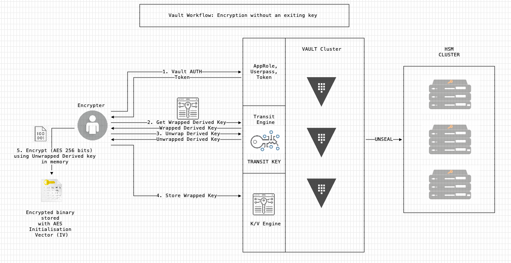
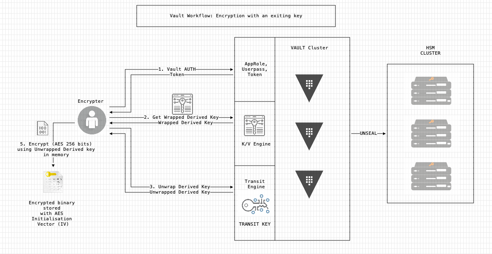
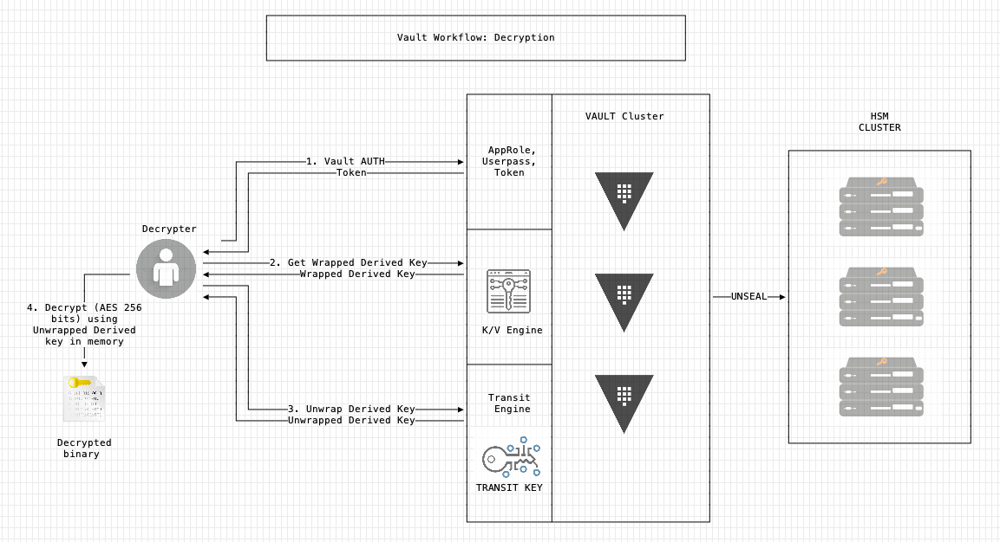

# Vault-Crypter
Vault-crypter is a tool written using Golang to crypt/decrypt files locally using HashiCorp Vault's encryption keys.

**Note:** This documentation works by workflows. At the moment the binary handles two environments the vault one or the local one.

**To be added:** 
* Logging system to be able to log to a file.
* Add a changeable local key name.
* Make two universal arguments for input file name and output file name (Instead of four: -cin, -con, -din, -don).
* Add two alerts to disallow -d with -cin and -con or -c with -din and -don.

**Content list:**
* [Vault Workflow: Prerequisite](#vault-prerequisite)
* [Vault Workflow: Binary preparation](#vault-binary)
* [Vault Workflow: Initialization](#vault-init)
* [Vault Workflow: Encryption without a pre-stored key](#vault-encryption)
* [Vault Workflow: Encryption with a pre-stored key](#vault-encryption-key)
* [Vault Workflow: Decryption](#vault-decryption)
* [Local Workflow: Encryption](#local-encryption)
* [Local Workflow: Decryption](#local-decryption)
* [Bonuses](#bonuses)
* [Contributors](#contributors)

## <a name="vault"></a>Vault Workflow

### <a name="vault-prerequisite"></a>Step 1 - Prerequisite

You'll need:
* A Vault Cluster.
* A Vault User that can create a Transit Engine and a KV Engine. 
* This repository's content.

### <a name="vault-binary"></a>Step 2 - Prepare the binary

Get the packages:

Coming soon...:wink:

Compile the binary:
```
$ go build vault-crypter.go
```

### <a name="vault-init"></a>Step 3 - Initialize the Vault

<details><summary><b>Automatic initialization:</b></summary>

The KV Engine, the Transit Engine and the key generation will be handle here automatically by the Vault-Crypter binary.

Three authentification methods are supported: token, userpass, approle.

Here is the list of the environment variables to provide vault-crypter with Vault connection information:

**Note:** All original Vault client environment variable should be compatible, however not all have been tested...

* VAULT_ADDR - REQUIRED - Must be the Vault cluster active node - Format: https://FQDN:8200
* VAULT_CACERT - CA can be specified to verify vault https certificate
* VAULT_SKIP_VERIFY - To avoid ssl verification
* VAULT_NAMESPACE - To set the namespace
* VAULT_TOKEN - If you are using the token auth method on Vault
* VAULT_ROLE_ID - If you are using the approle auth method on Vault
* VAULT_SECRET_ID - If you are using the approle auth method on Vault
* VAULT_USERNAME - If you are using the userpass auth method on Vault
* VAULT_PASSWORD - If you are using the userpass auth method on Vault

The first step is to set the VAULT_ADDR and the VAULT_CACERT if needed:

```
$ export VAULT_ADDR="https://VAULT_DOMAIN/"
```
	
Then export the variable with the user info to create the transit and KV engine:
```
$ export VAULT_TOKEN="s.XXXXXXXXXXXXXXXXXXXX"
```

Then use vault-crypter to init the vault environment:
```
$ vault-crypter -i
```
</details>

<details><summary><b>Manual initialization:</b></summary>

Log in to the vault and add:
* A KV engine version 2. You'll then need to use the argument "-pk" to specify the name to vault-crypter.
* A Transit engine. Same here with the argument "-pt".
* An "Encryption Key" using the "aes256-gcm96" type. Same here with the argument "-kt".

**Note:** For more details about the arguments, see the help section in the binary.
</details>

### <a name="vault-encryption"></a>Step 4 - Encryption without pre-stored keys


Your binary is ready to encrypt.

**Note:** By default, the workflow type is set on "vault" and the auth method is set on "token". It can be changed using arguments like -m for mode and -l for login method. 

See the help section in the binary for more details.

To encrypt:
```
$ vault-crypter -c -cin <INPUT_FILE_NAME> -con <ENCRYPTED_FILE_NAME>
```

<details><summary><b>Options:</b></summary>

Generally available arguments (not required):
* -l: The Vault auth login method available are: token, userpass, approle (default "token").
* -m: Mode to be used, can be local or vault (default "vault").

Required arguments:
* -c: To crypt file or binary.

Optional arguments (not required):
* -pt: Add a custom path for the transit engine (default "vault-crypter-transit").
* -kt: Key name for the transit engine (default "key").
* -pk: Add a custom path for the kv engine (default "vault-crypter-kv").
* -sk: Secret name for the stored wrapped key in the kv engine (default "transit-key").
* -p: Add a path to retrieve and create crypted and decrypt files. Works with -cin & -con Don't forget the / at the end ! (default "./").
* -cin: Add a crypt input file name without a path, just the name ! (default "input").
* -con: Add a crypt output file name without a path, just the name ! (default "encryptedfile").

</details>

### <a name="vault-encryption-key"></a>Step 5 - Encryption with pre-stored keys


To encrypt with an existing key inside the vault, you'll need to specify to vault-crypter which secret version to use with -sv.
This is the minimal requirement. 

However if you have a custom KV path and custom secret name, you'll need to add to -sv: -pk and -sk.

Command to encrypt:
```
$ vault-crypter -c -sv <KV_VERSION_NUMBER> -cin <INPUT_FILE_NAME> -con <ENCRYPTED_FILE_NAME>
```

<details><summary><b>Options:</b></summary>

Generally available arguments (not required):
* -l: The Vault auth login method available are: token, userpass, approle (default "token").
* -m: Mode to be used, can be local or vault (default "vault").

Required arguments:
* -c: To crypt file or binary.
* -sv: Version number for the stored wrapped key in the kv engine.

Optional arguments (not required):
* -pt: Add a custom path for the transit engine (default "vault-crypter-transit").
* -kt: Key name for the transit engine (default "key").
* -pk: Add a custom path for the kv engine (default "vault-crypter-kv").
* -sk: Secret name for the stored wrapped key in the kv engine (default "transit-key").
* -p: Add a path to retrieve and create crypted and decrypt files. Works with -cin & -con Don't forget the / at the end ! (default "./").
* -cin: Add a crypt input file name without a path, just the name ! (default "input").
* -con: Add a crypt output file name without a path, just the name ! (default "encryptedfile").

</details>

### <a name="vault-decryption"></a>Step 6 - Decryption


To decrypt with an existing key inside the vault, you'll need to specify to vault-crypter which secret version to use with -sv.
This is the minimal requirement. 

However if you have a custom KV path and custom secret name, you'll need to add to -sv: -pk and -sk.

Command to decrypt:
```
$ vault-crypter -d -sv <KV_VERSION_NUMBER> -din <INPUT_ENCRYPTED_FILE_NAME> -don <DECRYPTED_FILE_NAME>
```

<details><summary><b>Options:</b></summary>

Generally available arguments (not required):
* -l: The Vault auth login method available are: token, userpass, approle (default "token").
* -m: Mode to be used, can be local or vault (default "vault").

Required arguments:
* -d: To decrypt file or binary.
* -sv: Version number for the stored wrapped key in the kv engine.

Optional arguments (not required):
* -pt: Add a custom path for the transit engine (default "vault-crypter-transit").
* -kt: Key name for the transit engine (default "key").
* -pk: Add a custom path for the kv engine (default "vault-crypter-kv").
* -sk: Secret name for the stored wrapped key in the kv engine (default "transit-key").
* -p: Add a path to retrieve and create crypted and decrypt files. Works with -din & -don Don't forget the / at the end ! (default "./").
* -din: Add a decrypt input file name without a path, just the name ! (default "encryptedfile").
* -don: Add a decrypt output file name without a path, just the name ! (default "decryptedfile").

</details>

## <a name="local"></a>Local Workflow

### <a name="local-encryption"></a>Step 1 - Encryption

**Note:** If you want to create a key by hand, at the moment, the file should be named "key". No other name. And the content of the file needs to be base64 encoded. For the cli command, it stays the same with/without a key as all is handled automatically by the vault-crypter binary.

To encrypt:
```
$ vault-crypter -m local -c -cin <INPUT_FILE_NAME>
```

<details><summary><b>Options:</b></summary>

Required arguments:
* -m: Mode to be used, can be local or vault (default "vault").
* -c: To crypt file or binary.

Optional arguments (not required):
* -p: Add a path to retrieve and create crypted and decrypt files. Works with -cin & -con Don't forget the / at the end ! (default "./").
* -cin: Add a crypt input file name without a path, just the name ! (default "input").
* -con: Add a crypt output file name without a path, just the name ! (default "encryptedfile").

</details>

### <a name="local-decryption"></a>Step 2 - Decryption

To decrypt, the decryption key named "key", should be available in the folder from which the command is executed:
```
$ vault-crypter -m local -d -din <INPUT_FILE_NAME>
```

<details><summary><b>Options:</b></summary>

Required arguments:
* -m: Mode to be used, can be local or vault (default "vault").
* -d: To decrypt file or binary.

Optional arguments (not required):
* -p: Add a path to retrieve and create crypted and decrypt files. Works with -din & -don Don't forget the / at the end ! (default "./").
* -din: Add a decrypt input file name without a path, just the name ! (default "encryptedfile").
* -don: Add a decrypt output file name without a path, just the name ! (default "decryptedfile").

</details>

## <a name="Bonuses"></a>Bonuses

### Verbose:

To output informations on what is going on, you can add the argument "-v" to the command and it'll show more details:

Usage:
```
$ vault-crypter -i -v
```

### Colors:

To add colors to outputs, you can add the argument "-c" to the command and it'll show rainbows:rainbow::

Usage:
```
$ vault-crypter -i -v --color
```

### Lookup:

To verify the token informations, I've implemented the vault binary lookup feature into vault-crypter:

Usage:
```
$ vault-crypter --lookup
```

## FAQ

Coming one day...:wink:

## <a name="contributors"></a>Contributors
* **HashiCorp Vault Binary Code** from which I get all the pre-coded interaction with a vault cluster.
* **Mitchell Hashimoto** - For his cli package available here: github.com/mitchellh/cli.
* **Ryan Uber** - For his columnize package that helps me output information correctly. Available here: github.com/ryanuber/columnize.
* **Brian Shumate** - For his HashiCorp logo generator - github.com/brianshumate/hashii
* **Sebastien Braun** - For his ideas, insights and schematics - github.com/planetrobbie
* **Gauthier Donikian** - github.com/skulblaka24
